

  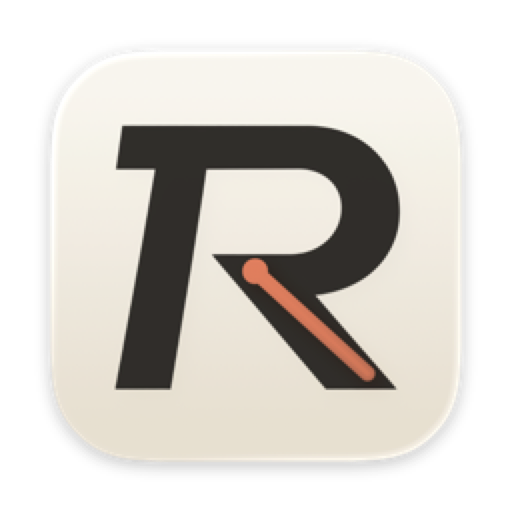

<h1 align="center">Recap</h1>

  <b>Follow the source. Return to the lecture.</b> 
  <i>把一节课，收束成一条复习路径。</i>

  <a href="https://recap.rio2333.com/"><b>recap.rio2333.com</b></a>

  English · <a href="README.zh-Hans.md">简体中文</a>

  
  
  
  
  

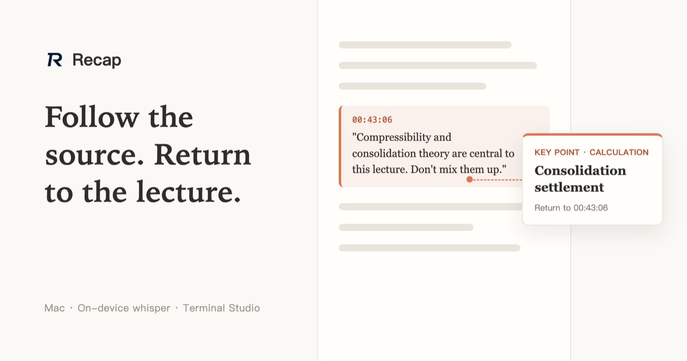

Course replay → on-device transcript → exam key points → lecture-note PDF, all inside one native Mac app. Transcription runs a whisper model fully offline; only the optional analysis step talks to an LLM endpoint you configure yourself — no ffmpeg, no Python, no external binaries.

## Features

### Course workspace · Evidence Thread

  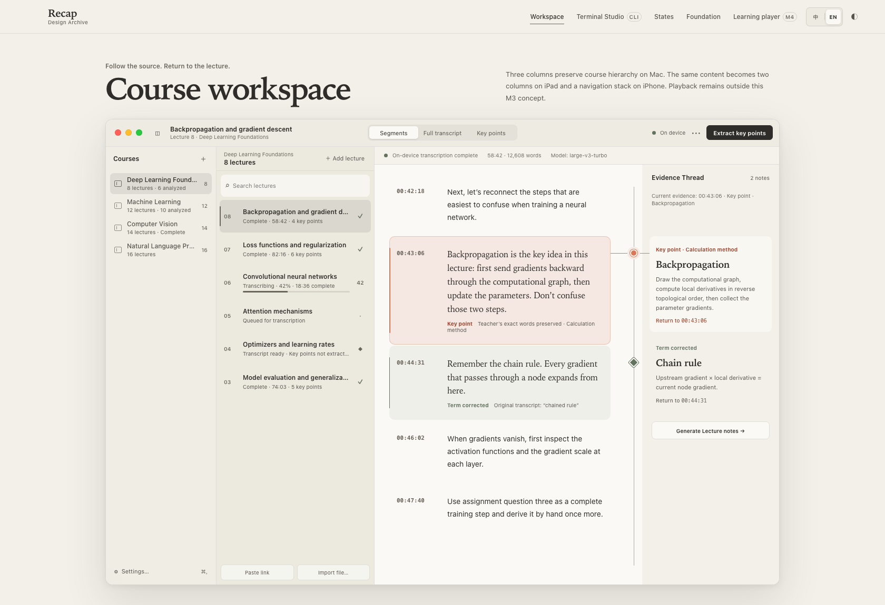
  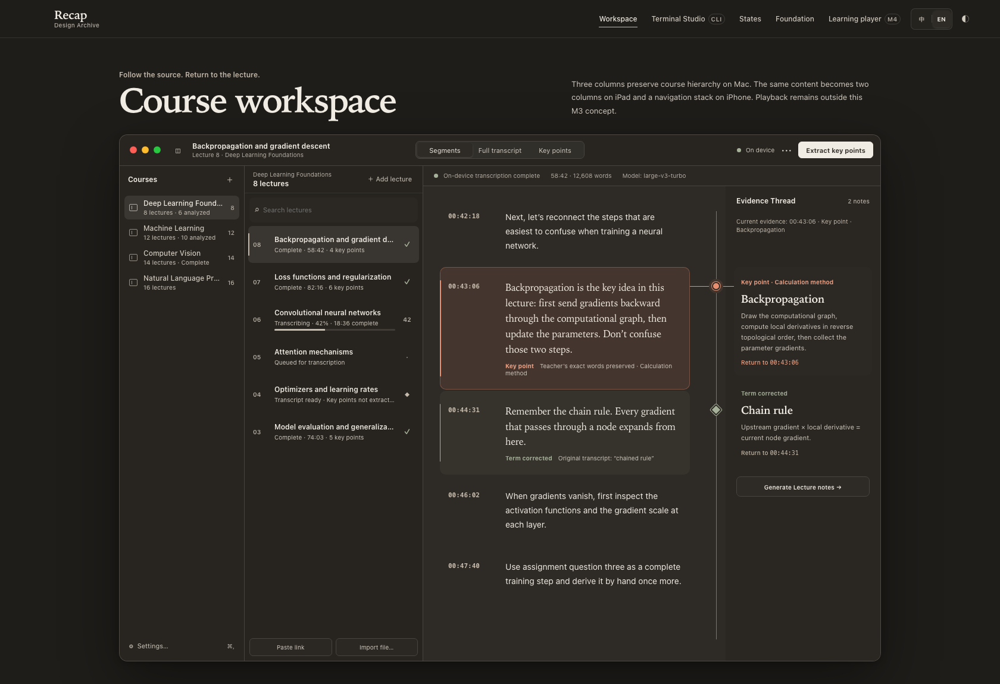

- Paste direct links to classroom replays or import local audio/video; whisper transcribes on this device. Batch-paste many links at once, and merge multi-part videos into a single lecture
- **Evidence Thread**: every extracted key point links back to the teacher's exact words in the transcript — takeaways are reading entry points, never posing as something the teacher said
- The key-points page collects must-memorize items, core concepts, solution paths, common mix-ups, and assignments; a course-wide exam review is one click away

### Learning player · Focus Rail

  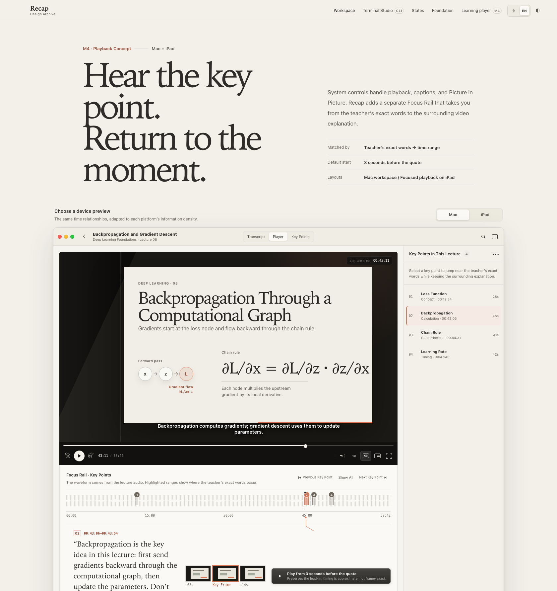
  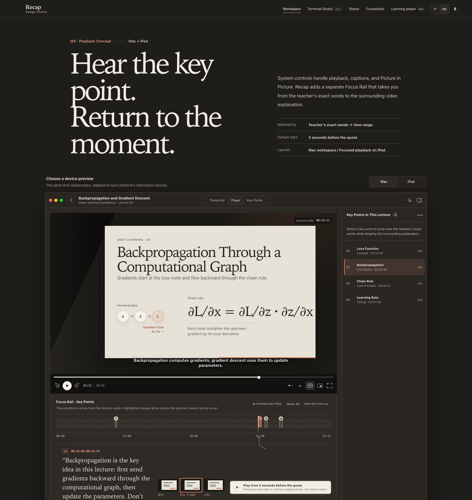

- Playback keeps AVKit semantics and presents multi-part lectures part by part; the Focus Rail waveform marks the teacher's exact words as **ranges**, not single points
- Selecting a key point starts 3 seconds before the quote to preserve the lead-in; previous/next stepping crosses parts automatically, and parts auto-advance when one ends

### Terminal Studio

  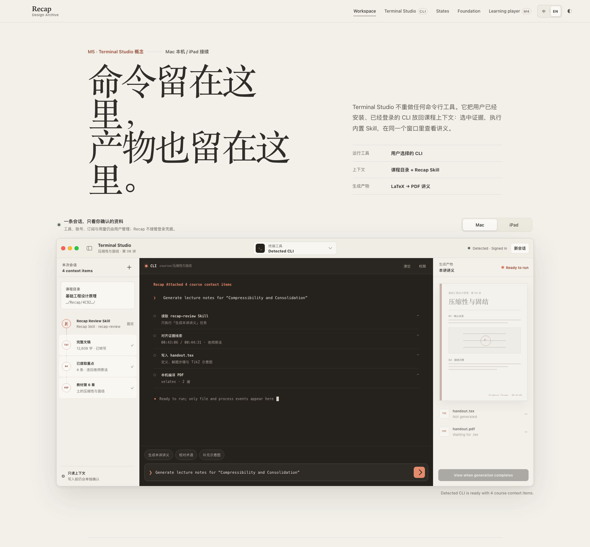
  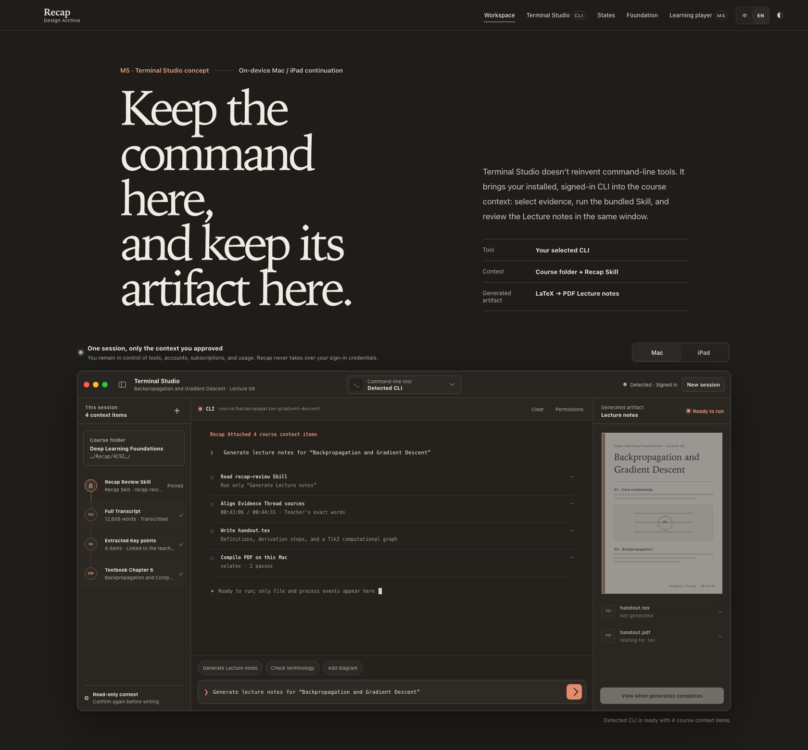

- Run your own CLI inside the course context: installed tools (claude / codex / gemini / grok / kimi) are detected automatically, with the bundled skill, transcript, and key points already attached
- Watch the live terminal output, stop anytime, and open the finished PDF straight from the artifact pane — the command stays here, and so does its artifact

### Lecture notes

- Generated without leaving the app: run your CLI in Terminal Studio, or pick "Generate with API" — both follow the same bundled skill and end in a LaTeX-typeset PDF (TikZ diagrams included), rendered in place with a night mode
- Notes follow the course language — English courses get English notes on an English LaTeX template, Chinese courses keep the ctex one; any CLI in the course folder works too (`claude "Generate lecture notes for Week 1"`)

## macOS Integration

- Native Mac Catalyst app built with UIKit — not a web wrapper
- Notarized, Developer ID–signed dmg with a drag-to-install window
- In-place updates: a persistent pill downloads the new release, installs it, and relaunches
- The bundled skill installs under every CLI convention (`.claude/skills`, `.agents/skills`, `AGENTS.md`, `GEMINI.md`) — any agent that enters the course folder picks it up
- Bilingual interface (English / Simplified Chinese) following the system language; reveal-in-Finder throughout

## Requirements

- macOS 14 Sonoma or later, Apple silicon
- A ggml whisper model (~1.5 GB, downloaded in onboarding — or bring your own `.bin`)
- Optional: an OpenAI-compatible endpoint (OpenRouter, a private gateway, or local Ollama) for key-point extraction
- Optional: BasicTeX (`xelatex`) for locally compiled lecture notes; a CLI agent for Terminal Studio

## Installation

1. Download the latest dmg from **[recap.rio2333.com](https://recap.rio2333.com/)** or the **[Releases](https://github.com/zhan2333/Recap/releases)** page
2. Drag Recap into Applications — the dmg is notarized and opens right away
3. Follow onboarding to fetch the whisper model, then create a course and add your first lecture

  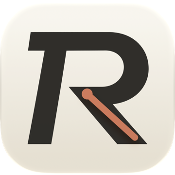
  &nbsp;
  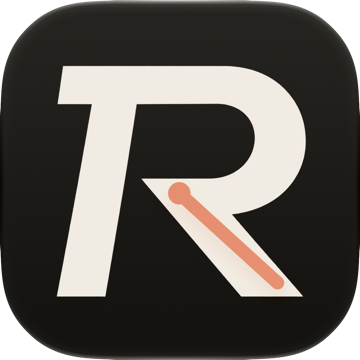
  &nbsp;
  
  &nbsp;
  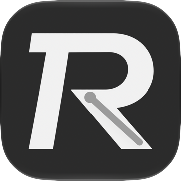

## Why it works this way

Recap is a native Mac Catalyst app in UIKit, and most of its design is one decision repeated: do the work where the data already is, and let tools you already pay for do the rest.

**Your CLI subscription does the thinking — no second API bill.** Terminal Studio is a real terminal: a login shell on a PTY, opened in the course folder, rendered with SwiftTerm. It detects the agents already installed on your Mac (claude, codex, gemini, grok, kimi) and runs them as *you*, with the credentials they already hold. If you pay for a Claude or Codex subscription, extracting key points and writing lecture notes runs on that subscription — Recap never proxies your work through a key of its own, and you don't need a separate API account to get the good models. Prefer a key? The same jobs also run through any OpenAI-compatible endpoint you configure. Both paths follow the same instructions.

**The skill ships inside the app, so any agent arrives already briefed.** `App/recap-review-skill.md` is both the product spec and the agent's instructions: it defines the file names and JSON shapes of a course folder, and it installs itself under four conventions (`.claude/skills`, `.agents/skills`, `AGENTS.md`, `GEMINI.md`). Whatever agent you launch in that folder already knows what to read, what to write, and where — no prompt engineering on your side, and its output lands in files the app renders directly.

**The course folder is the contract, not a database.** Media, `segments.json`, `analysis.json`, the LaTeX source and the PDF are plain files in one directory. That is why the same course works from the app, from your own terminal, or from a script — and why an agent's work shows up in the UI the moment it finishes writing.

**Transcription never leaves the Mac.** whisper.cpp is vendored as the official XCFramework plus an arm64 Mac Catalyst slice built from the same tag, so a lecture recording is decoded and transcribed in-process — no ffmpeg, no Python, no upload. `AudioExtractor` decodes with `AVAssetReader` and resamples to 16 kHz mono in a separate streaming pass, because asking the reader to convert in one step returns the right frame count with wrong audio.

**Every takeaway keeps its receipt.** `EvidenceMatcher` links each extracted point back to the transcript by taking the better of a longest-common-substring and a bigram-overlap score, accepting matches above 0.55. That is what lets a key point jump the player to the moment the teacher said it, and it is why the skill asks for quotes close to the spoken words rather than polished prose.

**Adding the textbook makes the agent measurably better.** Speech-to-text mishears exactly the words that matter — names, formulas, domain terms — and a transcript alone gives an agent no way to tell a mishearing from a real term. Import the textbook and the app extracts its text with page markers; the skill then builds a table of contents, splits it into per-chapter files, and reads only the chapter a lecture belongs to. The agent now has the correct terminology and the surrounding argument next to the transcript, so it can correct misheard terms, cite the page a claim comes from, and write lecture notes that follow the book's structure instead of guessing at it.

**Shipping is part of the product.** `scripts/package-release.sh` builds Release, signs with Developer ID and the hardened runtime, lays out the installer dmg, notarizes and staples it. In the app, a persistent pill downloads the new release, replaces the bundle in place and relaunches — updating is one click, not a trip to a download page.

## Contributing

See [CONTRIBUTING.md](CONTRIBUTING.md) — build setup, architecture notes, coding guidelines, and how AI-assisted contributions work here.

## License

Copyright © 2026 zhan2333. The current Recap source is licensed under the [GNU General Public License v3.0 only](LICENSE). Third-party components retain their own licenses; see [THIRD_PARTY_NOTICES.md](THIRD_PARTY_NOTICES.md).

Releases up to and including v2.1.0 were published under the MIT License. The existing MIT grants for those versions remain in effect.
