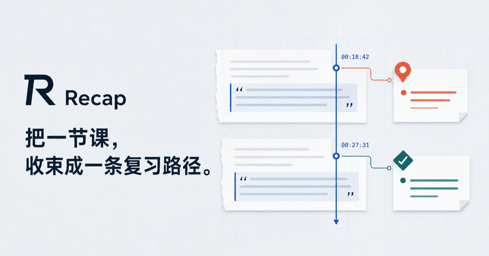
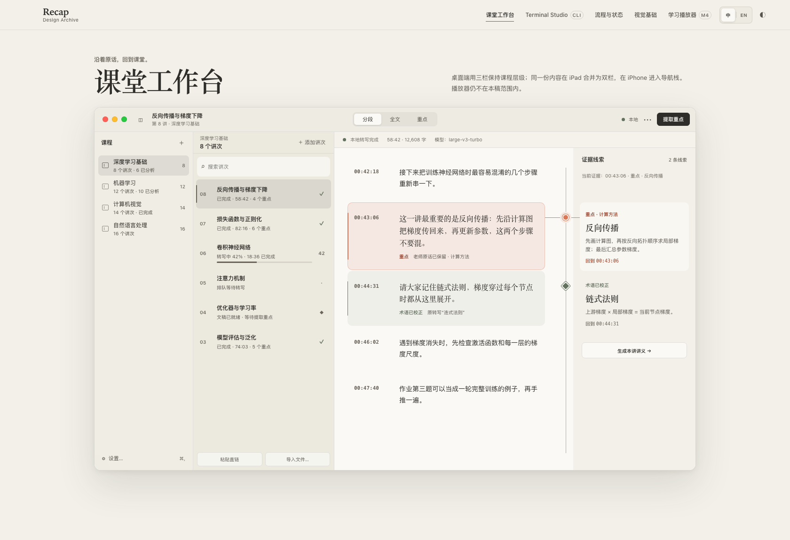
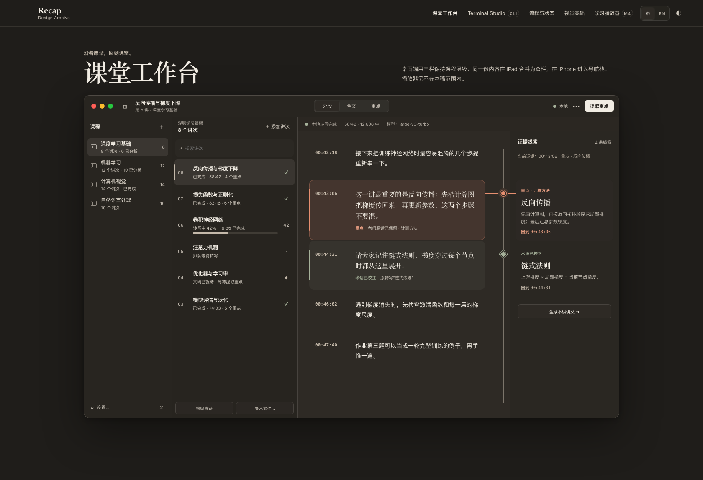
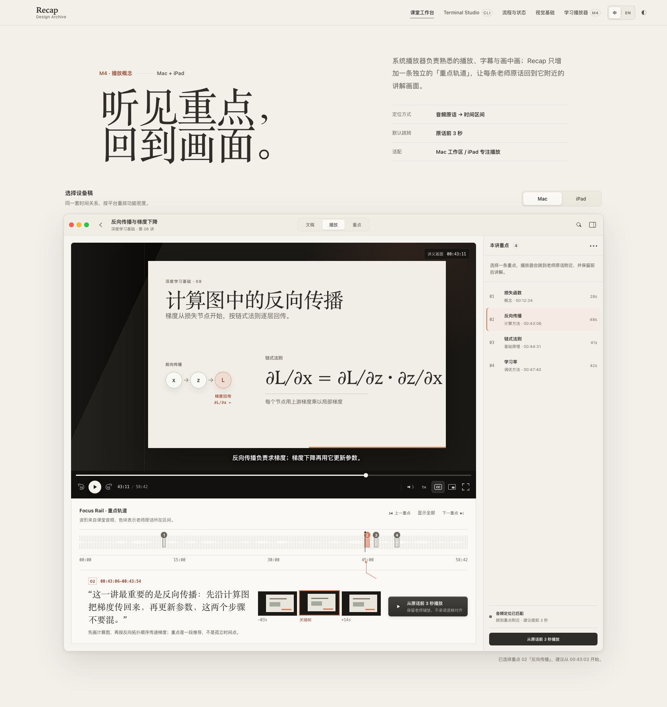
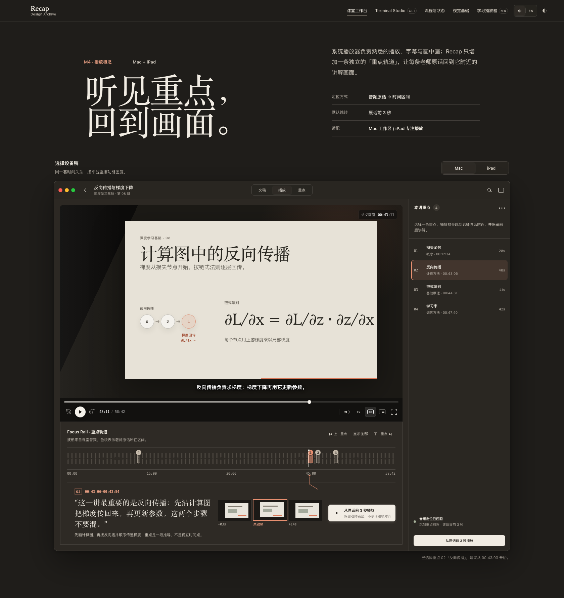
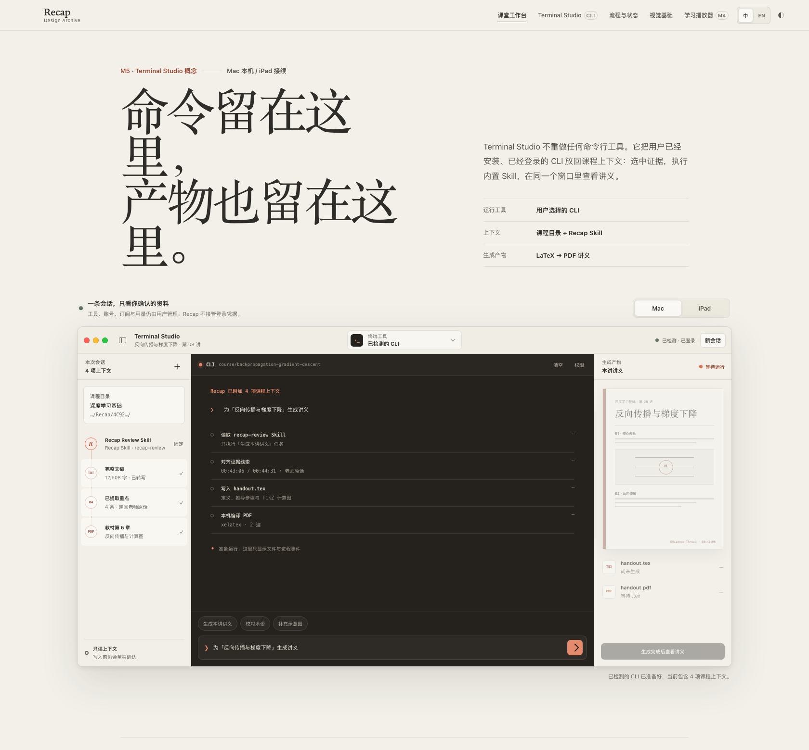
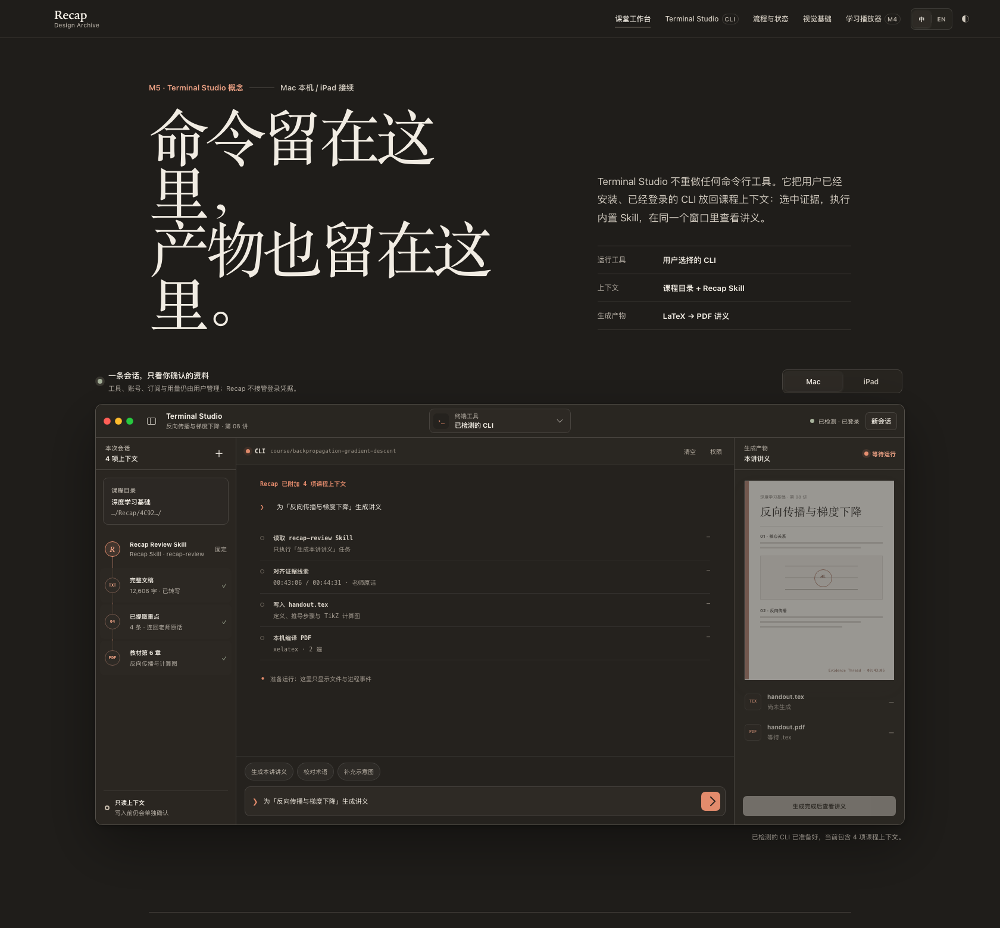

  

<h1 align="center">Recap</h1>

  <b>把一节课，收束成一条复习路径。</b> 
  <i>Follow the source. Return to the lecture.</i>

  <a href="README.md">English</a> · 简体中文

  
  
  
  
  

课堂回放 → 本机转写 → 考试重点 → 讲义 PDF，全流程在一个原生 Mac app 里完成。转写全程离线跑 whisper 模型，只有可选的分析步骤走你自己配置的 LLM 接口——没有 ffmpeg，没有 Python，没有外部二进制。

## 功能

### 课堂工作台 · Evidence Thread

  
  

- 粘贴云课堂视频直链或导入本地音视频，whisper 在本机离线转写；批量粘贴多条直链一次入队，多段视频可合成一个讲次
- **证据线索**：AI 提取的每条考试重点都连回老师原话所在的文稿位置——结论是阅读入口，不伪装成老师亲口说过的话
- 重点页汇总必背、核心概念、解题方法、易混易错与作业；课程级考试重点一键汇总

### 学习播放器 · Focus Rail

  
  

- 播放器保持 AVKit 习惯，分段呈现多个视频；Focus Rail 波形轨道用**区间**标出老师原话所在位置
- 点击重点跳到原话前 3 秒，保留老师铺垫；上一/下一重点跨段自动切换视频，段播完自动接续

### Terminal Studio

  
  

- 在课程上下文里直接运行你自己的 CLI：自动检测本机已装的工具（claude / codex / gemini / grok / kimi），skill、文稿和重点已自动就位
- 实时查看终端输出、随时停止，产物区一键打开生成好的讲义 PDF——命令在这里，产物也回到这里

### 讲义

- 不出 app 就能生成：在 Terminal Studio 里跑你的 CLI，或选「用 API 生成」——两条路遵循同一份内置 skill，产出 LaTeX 排版的讲义 PDF（含 TikZ 示意图），app 内直接阅读、支持夜间模式
- 讲义跟随课程语言——英文课程用英文模板出英文讲义，中文课程用 ctex 模板；也可以在课程目录里对任意 CLI 直接说 `claude "为「第一周」生成讲义"`

## macOS 集成

- UIKit 编写的原生 Mac Catalyst app，不是网页套壳
- Developer ID 签名并经过公证的 dmg，打开即是拖拽安装界面
- 就地更新：底部常驻 pill 一键下载新版本、安装并自动重启
- 内置 skill 按各家 CLI 的约定同时落盘（`.claude/skills`、`.agents/skills`、`AGENTS.md`、`GEMINI.md`），任何 agent 进入课程目录即可使用
- 界面中英双语，跟随系统语言；各处支持「在访达中显示」

## 系统要求

- macOS 14 Sonoma 及以上，Apple silicon
- 一个 ggml 格式的 whisper 模型（约 1.5 GB，引导页内下载，也可自备 `.bin`）
- 可选：任意 OpenAI-compatible 接口（OpenRouter、自建网关或本地 Ollama），用于提取重点
- 可选：BasicTeX（`xelatex`）用于本机编译讲义；一个 CLI agent 用于 Terminal Studio

## 安装

1. 从 **[Releases](https://github.com/zhan2333/Recap/releases)** 下载最新 dmg
2. 把 Recap 拖入「应用程序」——dmg 已公证，直接打开即可
3. 跟随引导下载 whisper 模型，然后新建课程、添加第一个讲次

  
  &nbsp;
  
  &nbsp;
  
  &nbsp;
  

## 参与贡献

见 [CONTRIBUTING.md](CONTRIBUTING.md)——构建配置、架构要点、代码规范，以及 AI 协作贡献的方式。

## 许可证

Copyright © 2026 zhan2333。Recap 当前源码采用 [GNU General Public License v3.0 only](LICENSE) 许可。第三方组件保留各自的许可证，详见 [THIRD_PARTY_NOTICES.md](THIRD_PARTY_NOTICES.md)。

截至 v2.1.0（含）的发行版此前按 MIT License 发布，这些版本已经授予的 MIT 权利继续有效。
